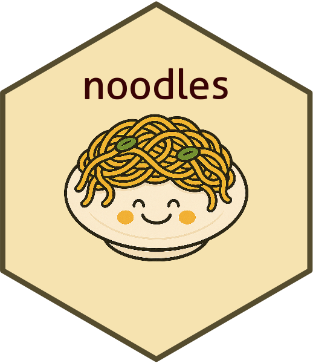

<!-- README.md is generated from README.Rmd. Please edit that file -->

```{r, include = FALSE}
knitr::opts_chunk$set(
  collapse = TRUE,
  comment = "#>",
  fig.path = "man/figures/README-",
  out.width = "100%"
)
```

# noodles 
<!-- badges: start -->
[](https://lifecycle.r-lib.org/articles/stages.html#experimental)
[](https://CRAN.R-project.org/package=noodles)
<!-- badges: end -->

noodles is a catch-all R package for utilities useful for routine survey data
wrangling and analysis tasks in R.

## Installation

Instructions to come.

``` {r, eval = FALSE, include = FALSE}

pgk <- "file/path/to/package"
install.packages(pkg, 
                 # this indicates to R that the package is being installed 
                 # from a local path
                 repos = NULL, 
                 # and this confirms that you are installing from source,
                 # as opposed to the many other formats R packages can take
                 type = "source")  
```

## Examples

Package documentation coming soon.

## Questions?

Please reach out to J.J. Moncus.
