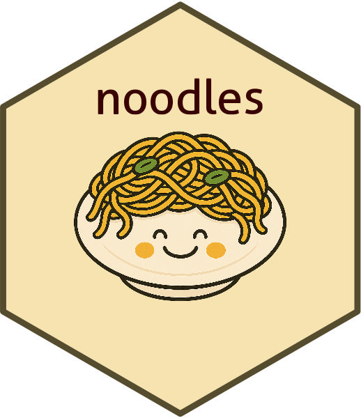

<!-- README.md is generated from README.Rmd. Please edit that file -->

# noodles 

<!-- badges: start -->

[](https://lifecycle.r-lib.org/articles/stages.html#experimental)
[](https://CRAN.R-project.org/package=noodles)
<!-- badges: end -->

noodles is a catch-all R package for utilities that Gartner PPR
associates may find useful for doing routine data wrangling and analysis
tasks in R.

## Installation

The package is currently hosted locally by the Customer Service and
Support PPR team. Reach out to J.J. Moncus to receive a copy of the most
recent build.

Once a copy is saved locally on your machine, you can install the
package with something like this:

``` r

pgk <- "file/path/to/package"
install.packages(pkg, 
                 # this indicates to R that the package is being installed 
                 # from a local path
                 repos = NULL, 
                 # and this confirms that you are installing from source,
                 # as opposed to the many other formats R packages can take
                 type = "source")  
```

## Examples

Package documentation coming soon.

## Questions?

Please reach out to J.J. Moncus or the Customer Service and Support PPR
team for details on package development.
