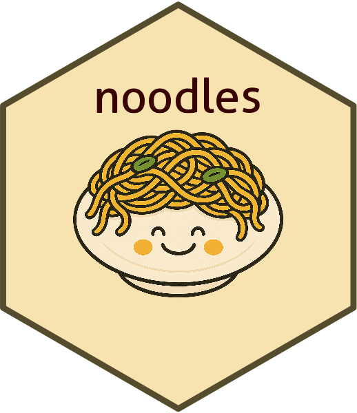

<!-- README.md is generated from README.Rmd. Please edit that file -->

# noodles 

<!-- badges: start -->

<!-- badges: end -->

noodles is a catch-all R package for utilities useful for routine survey
data wrangling and analysis tasks in R.

## Installation

Instructions to come.

## Examples

Package documentation coming soon.

## Questions?

Please reach out to J.J. Moncus.
